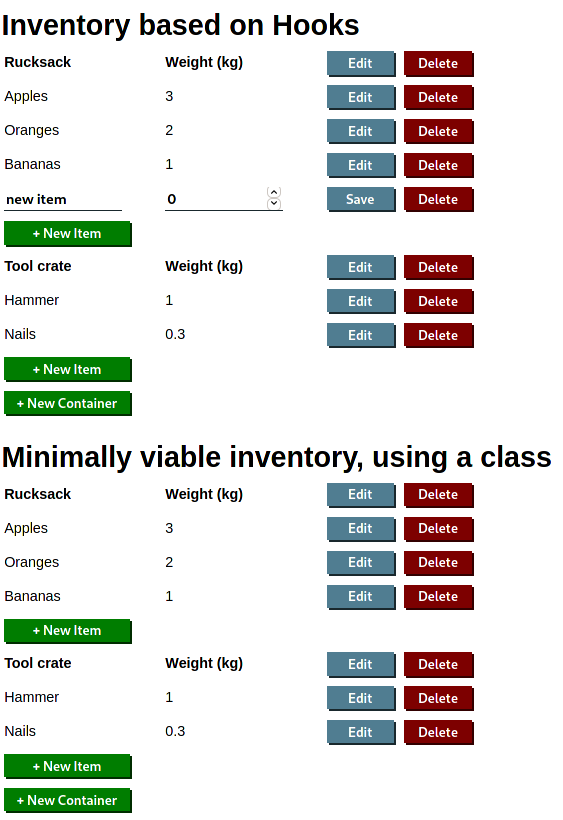

# react-crud
A minimalist, front-end only CRUD single page application made with React

This project was bootstrapped with [Create React App](https://github.com/facebook/create-react-app).

The features to demonstrate in this demo are just the 4 basic CRUD operations (Create, Read, Update, Delete), using
nested components. Two implementations are shown together, one using Hooks (InventoryHooks.js), and one using a single
class (InventoryMvp.js). Only a _uuid_ library is used beyond basic React.



## First Install

Navigate to the project folder and run
```
npm install
```
To install every package described in package.json

If you are on Windows and you get an error like
```
'npm' is not recognized as an internal or external command,
operable program or batch file.
```
Then first you need to [install Node.js](https://nodejs.org/en/download/)

## Starting the App

```
npm start
```
Runs the app in development mode. Open [http://localhost:3000](http://localhost:3000) to view it in the browser.

The page will reload if you make edits. You will also see any lint errors in the console.

## About Create React App

You can learn more about Create React App in the [documentation](https://facebook.github.io/create-react-app/docs/getting-started).
